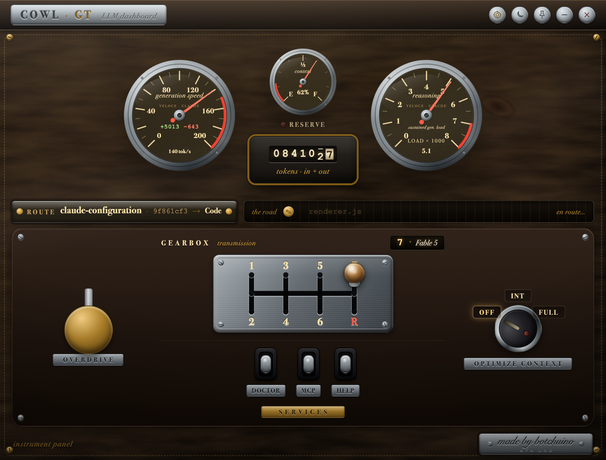

# COWL_GT — a vintage cowl for Claude Code

> *Cowl* (n.) — on 1920s–30s automobiles, the section of coachwork between the
> hood and the windshield: **the part of the body that housed the instruments.**
> That's exactly what this is, for your LLM.

A floating desktop dashboard for **working better with LLMs in terminal
sessions**, styled as a vintage Italian grand tourer's instrument cowl. Live
gauges show what your model is actually doing — generation speed (tok/s),
sustained reasoning load (RPM), context "fuel level", tokens travelled on a
true roller odometer and lines of code as the trip counter — and physical-looking controls let you
**shift gears** (switch models), hit **OVERDRIVE**, flip **skill switches**,
and pull the **wiper stalk** to clean your context, all without touching the
terminal. Built for Claude Code today; other engines later (see
[Future work](#future-work)).

```
      ┌────────────────────────────────────────────────────────┐
      │  ◜ TACHIMETRO ◝      ◜ CONTESTO ◝      ◜ CONTAGIRI ◝   │
      │    tok/s, ± lines   fuel + RISERVA     sustained load   │
      │                   [TOKENS odometer]                     │
      │  ROUTE cwd · session → target    the road (activity)    │
      │ ┌─────────────────────────────────────────────────────┐ │
      │ │              1   3   5   7                          │ │
      │ │ ⚡OVERDRIVE   ├───┼───┼───┤   gear h-gate    ⌁TERGI⌁ │ │
      │ │              2   4   6   R ← STOP (Escape)  wipers  │ │
      │ │           ◦ DOCTOR  ◦ MCP  ◦ HELP  (SERVIZI)        │ │
      │ └─────────────────────────────────────────────────────┘ │
      └────────────────────────────────────────────────────────┘
```



**macOS · Windows · Linux (X11/XWayland).** Made by botchuino.

---

## Why (the hard constraint)

**There is no API to switch models in a running Claude Code session.** No IPC,
no config hot-reload, no live "set model" hook — Claude Code reads its model at
session start.

The only mechanism that works against a *live* session is **keystroke
injection**: the app activates your terminal and *types* into it — e.g.
`/model opus` + Return — exactly as if you had typed it yourself. Every gear,
the OVERDRIVE button, each skill switch, and the wipers work this way. The
transmission is per-OS, same contract everywhere:

- **macOS** — `osascript` + System Events (needs the **Accessibility
  permission**, see Requirements)
- **Windows** — PowerShell window activation + `SendKeys` (no special
  permission)
- **Linux** — `xdotool` (X11 or XWayland; pure Wayland is not supported)
- **WSL2** — Windows interop: the dashboard runs on the Linux side but drives
  your Windows-side terminal (VS Code, Windows Terminal) through
  `powershell.exe`, same transmission as native Windows

If the transmission can't work at all on your machine (no backend binary, WSL
interop disabled), the dashboard boots in **modalità vetrina** — display-only:
gauges stay alive, the console dims and its tooltip says why. And when a
single command fails (no target window, missing Accessibility grant), the
amber **CHECK-ENGINE telltale** lights in the title bar with the exact error
in its tooltip — no more silently dead buttons.

To make a gear choice stick for **future** sessions, shifting also writes the
model into `~/.claude/settings.json` (best-effort). Only the keystroke affects
the current session.

Live gauges come from a transparent **statusline tap**: Claude Code pipes
session JSON to its `statusLine.command` on every render; the tap records it to
`~/.claude/dashboard/state.json` (atomic write) and delegates the same bytes to
your real statusline, so your bar looks unchanged.

```
Claude Code ──statusline JSON──▶ statusline-tap.js ──▶ state.json ──▶ gauges
                                        │
                                        └──▶ your real statusline (unchanged)
Dashboard controls ──osascript keystrokes──▶ your terminal (Claude Code TUI)
```

---

## Requirements

- **macOS, Windows, or Linux (X11/XWayland)**
- **Node.js 18+** and npm
- A supported terminal app (iTerm2, Terminal, Ghostty, WezTerm, kitty,
  Alacritty, Warp, Hyper, Windows Terminal, GNOME Terminal, Konsole, VS Code,
  Cursor, … — configurable via `knownTerminals`)
- Per platform:
  - **macOS** — **Accessibility permission** for the app sending keystrokes
    (Electron and/or your terminal): *System Settings → Privacy & Security →
    Accessibility*
  - **Windows** — nothing extra (PowerShell 5+ ships with Windows)
  - **Linux** — `xdotool` (`sudo apt install xdotool` / `dnf install xdotool`);
    an X11 session, or Wayland with the terminal running under XWayland

---

## Install

The app runs from `~/.claude/dashboard`:

**macOS / Linux:**

```bash
git clone <this-repo>
cd <this-repo>
mkdir -p ~/.claude/dashboard
cp -R ./. ~/.claude/dashboard/
cd ~/.claude/dashboard
npm install
chmod +x launch-dashboard.sh
```

**Windows (PowerShell):**

```powershell
git clone <this-repo>
cd <this-repo>
New-Item -ItemType Directory -Force "$env:USERPROFILE\.claude\dashboard" | Out-Null
Copy-Item -Recurse -Force .\* "$env:USERPROFILE\.claude\dashboard\"
cd "$env:USERPROFILE\.claude\dashboard"
npm install
```

Then wire up `~/.claude/settings.json` (merge with your existing blocks, don't
overwrite — and remember your previous statusline command so you can revert):

**Statusline tap** — point `statusLine.command` at the tap; it delegates to
your existing statusline wrapper (`~/.claude/ecc-statusline-wrapper.js`) and
prints a minimal fallback line if that's missing:

```json
{
  "statusLine": {
    "type": "command",
    "command": "node ~/.claude/dashboard/statusline-tap.js"
  }
}
```

**SessionStart hook** — auto-launch the dashboard, async so it never blocks
session start (the launcher is idempotent; a second launch just focuses the
existing window). On macOS/Linux either the bash script or the Node launcher
works; on Windows use the Node launcher:

```json
{
  "hooks": {
    "SessionStart": [
      {
        "hooks": [
          {
            "type": "command",
            "command": "node ~/.claude/dashboard/launch-dashboard.js",
            "async": true
          }
        ]
      }
    ]
  }
}
```

(Windows: `"command": "node \"%USERPROFILE%\\.claude\\dashboard\\launch-dashboard.js\""` —
same for the statusline and PostToolUse commands, which use `~` above.)

**PostToolUse hook** — feed the live **activity strip** (which tool Claude is
using right now, e.g. `Edit renderer.js` or `Bash npm test`), async so it never
slows tool calls:

```json
{
  "hooks": {
    "PostToolUse": [
      {
        "hooks": [
          {
            "type": "command",
            "command": "node ~/.claude/dashboard/hooks/activity-hook.js",
            "async": true
          }
        ]
      }
    ]
  }
}
```

Finally, on **macOS**, grant **Accessibility permission**. If keystrokes
silently do nothing, this is almost always the cause — enable both Electron and
your terminal app. On **Linux**, make sure `xdotool` is installed. On
**Windows**, no extra step.

Test-run any time with `cd ~/.claude/dashboard && npm start`.

---

## Updates — *richiamo in officina*

Because the app is *copied* into `~/.claude/dashboard`, the installed copy is
detached from git and won't learn about new releases on its own. So COWL_GT
checks for them itself:

- **Detection.** Once a day, the **main** process (the renderer's CSP is
  `connect-src 'none'`, so it *can't* touch the network — by design) reads the
  released `package.json`'s `version` from the public
  [`Botchuino/COWL_GT`](https://github.com/Botchuino/COWL_GT) repo via GitHub
  `raw` and compares it to the installed version. (Root or `dashboard/` layout
  is auto-detected; set `REPO`/`BRANCH` in `lib/updater.js` to retarget.)
- **The telltale.** When a newer version exists, an amber **recall lamp**
  (🔧) lights in the title bar next to ⚙. Hover for `v<from> → v<to>`.
- **One-click install.** Click the lamp once to arm (it turns red), once more
  to apply: the main process downloads the branch tarball, overlays the fresh
  files over `~/.claude/dashboard` (your `config.json` / `state.json` /
  `node_modules` live only there and aren't in the tarball, so they're never
  touched), runs `npm install` **only if** dependencies changed, then
  relaunches into the new version. No git, no code signing — same on macOS,
  Windows and Linux (needs the system `tar`, present everywhere modern).

**Cutting a release (maintainers).** Bump `version` in
[`package.json`](package.json), then publish the update to the public
`Botchuino/COWL_GT` repo's `main` (that repo is what the updater reads) — from
the dev repo, `./release.sh` does the sync (root-layout adaptation included).
Every installed copy lights its recall lamp within a day — the version bump
*is* the release signal.

---

## Configure

**Language.** Every label — chrome plates *and* the enamel gauge-face
engravings — speaks four languages with AI-native nomenclature (*generation
speed*, *context*, *reasoning*, *sustained gen. load*): set `"language"` in
`config.json` to `it` (default), `en`, `pt` or `es`, or pick one from the
in-app ⚙ panel. Custom labels you write yourself (gears, switches, a custom
wiper plate) stay exactly as engraved.


Everything is editable in `~/.claude/dashboard/config.json` (seeded from
`config.default.json` on first run) **or via the in-app config panel**. Map
your **own** skills, slash commands, and MCP tools — the defaults are just a
starting point.

- **`gears`** — the model shifter, an open H-gate machined into the nickel
  plate. Each gear has a `modelArg` (typed as `/model <modelArg>`), a
  `label` shown in the current-gear readout (the plate itself carries only
  engraved numerals — models are listed here in settings), and `match` tokens
  that highlight the currently *engaged* gear from the live model id (the gear
  whose tokens all match, with the most tokens, wins). The red **R** slot is
  not a gear: it's the STOP position — it sends Escape to interrupt the
  current run, then the lever springs back on its own.
- **`nos`** — the OVERDRIVE button: types `keystrokes`, optionally + Return.
- **`skillButtons`** — quick switches. `type:"text"` types a string
  (optionally + Return); `type:"chord"` sends a key chord like `ctrl+8` or
  `cmd+shift+k`. Ship your own `/mycommand` or MCP triggers here.
- **`wipers`** — the context wipers:
  - **INT** (intermittent) → `/compact` — squeegee the context down.
  - **FULL** → `/clear` — full wash; destructive. Fires on a single click by
    default; enable the **double-click safety** under _Garage Settings ›
    Safety_ (per-mode `confirm` flag) to guard against an accidental wipe.
- **`targetTerminal`** — `"auto"` picks the first running app from
  `knownTerminals`; set an exact app name (e.g. `"iTerm2"`) to force one. Also
  switchable from the UI. It must be the terminal running your Claude Code
  session.
- **`injectEnterDelayMs` / `activateDelayMs`** — timing knobs; increase if
  keystrokes land before the terminal is focused.
- **`otel`** — the opt-in rich-telemetry receiver (see next section):
  `{ "enabled": false, "port": 4318 }`. Changing it takes effect at the next
  launch.

---

## Telemetria ricca — the trip computer (opt-in)

The statusline tap is the lowest-latency signal Claude Code exposes — it
stays the heartbeat of the needles. But Claude Code can also emit
**OpenTelemetry** events with data the tap never sees: per-turn cost and
duration, effort/speed, cache hits, the real effect of a `/compact`. COWL_GT
can host a tiny local OTLP receiver for them and light up a **computer di
viaggio** strip under the route plate:

```
computer di viaggio   12s · $0.42 · high · cache 87%          tergi −125k
```

Left to right: last-turn duration, cost, effort (+ `fast` when fast mode is
on), cache-hit share of the prompt — and for two minutes after a compaction,
the tokens the wiper actually saved.

**Enable it** in `~/.claude/dashboard/config.json`:

```json
{ "otel": { "enabled": true, "port": 4318 } }
```

then start Claude Code with telemetry pointed at the dashboard:

```bash
export CLAUDE_CODE_ENABLE_TELEMETRY=1
export OTEL_LOGS_EXPORTER=otlp
export OTEL_EXPORTER_OTLP_PROTOCOL=http/json
export OTEL_EXPORTER_OTLP_ENDPOINT=http://127.0.0.1:4318
export OTEL_LOGS_EXPORT_INTERVAL=1000   # snappier than the 5s default
```

Privacy notes: the receiver binds **127.0.0.1 only** and runs in the main
process (the renderer's CSP still forbids all network); nothing is stored or
forwarded. The default install stays **fully offline** — with `otel.enabled`
false (the default) no port is ever opened. Subagent/auxiliary API requests
are ignored so the readout narrates your main conversation, not a workflow's
fan-out.

---

## Live data (state fields & gauges)

The statusline tap writes `~/.claude/dashboard/state.json` with:

- `modelId` / `modelName` — the live model (drives the engaged-gear highlight).
- `costUsd` — running session cost (recorded in state.json; the dial was retired — tokens are the mileage).
- `contextPct` / `contextUsed` / `contextSize` — context-window usage.
- `tokensIn` / `tokensOut` — cumulative session input/output tokens; the
  renderer differentiates successive states to show a live tokens-per-second
  rate.
- `linesAdded` / `linesRemoved` — cumulative lines of code changed.
- `sessionId` / `cwd` / `updatedAt` — session identity and freshness.

The PostToolUse hook writes `~/.claude/dashboard/activity.json`
(`{ tool, detail, sessionId, cwd, at }`); it is merged into the pushed state as
`state.activity` and dropped when older than 120 s. The main process also
attaches `state.targetApp` — the resolved keystroke-injection target terminal
(cached, refreshed at most every 5 s).

**Fuel gauge semantics:** the FUEL needle reads like a real tank — it starts at
**F** (full, empty context) and swings toward **E** as the context window fills.
When less than **20%** of the context remains, the amber **RISERVA** (reserve)
lamp lights up: time to pull the TERGI stalk (`/compact` or `/clear`).

---

## Reverting

1. Restore your statusline in `~/.claude/settings.json` (point
   `statusLine.command` back at your previous command — the tap only ever wrote
   `~/.claude/dashboard/state.json` and delegated, so removal is clean).
2. Remove the `SessionStart` hook entry that calls `launch-dashboard.sh` and
   the `PostToolUse` hook entry that calls `activity-hook.js`.
3. Quit the app (its close button quits everything) and optionally delete
   `~/.claude/dashboard`.

---

## Caveats

- **Wayland:** on Linux, keystroke injection needs X11 or a terminal running
  under XWayland — `xdotool` cannot reach Wayland-native windows.
- **WSL2:** the dashboard detects WSL and drives your **Windows-side**
  terminal through `powershell.exe` interop (`xdotool` can't see Windows
  windows). Needs interop enabled (`/etc/wsl.conf` → `[interop] enabled=true`,
  the default); if it's off, COWL boots in modalità vetrina and says so. The
  first keystroke after a while can take a couple of seconds — that's
  PowerShell cold-starting across the boundary. If Electron won't start, the
  launcher retries with `--no-sandbox` on its own; for manual runs use
  `node_modules/.bin/electron . --no-sandbox`.
- **macOS app translocation:** if your terminal app runs from `~/Downloads`
  (or anywhere quarantined), macOS relaunches it from a randomized path and the
  **Accessibility grant never sticks** — keystrokes fail silently with
  osascript error 1002. Move the app to `/Applications` and re-grant.
- **Windows chords:** `SendKeys` has no Windows-key token, so `cmd`/`command`
  chords are rejected there (`ctrl`/`alt`/`shift` all work).
- **Windows focus:** foreground-window rules can occasionally swallow the
  activation; if keystrokes land in the wrong window, raise `activateDelayMs`.
- **Multi-session:** all sessions write the single
  `~/.claude/dashboard/state.json`, so with multiple concurrent Claude Code
  sessions the gauges show whichever session rendered last, and keystrokes go
  to the one configured target terminal. Best with one active session at a
  time.
- **Offline by default.** No CDN, no webfonts — everything is local. The only
  network touches are opt-in/outbound-explicit: the once-a-day update check
  against GitHub, and the OTel receiver (off by default, and even when on it
  binds 127.0.0.1 only).
- **VS Code integrated terminal:** works (target app `Code`), with one focus
  caveat — macOS restores focus to wherever you last were inside VS Code. If
  you last touched the editor (not the terminal), injected keystrokes would
  land in your file. If you normally interact with Claude Code in the
  integrated terminal, focus is already right; otherwise click into the
  terminal once before shifting.

---

## Future work

- **COWL for Codex CLI — next up.** The cowl is engine-agnostic by design:
  keystroke injection doesn't care what's running in the terminal. A Codex CLI
  variant is planned next (its own telemetry tap + gear map), with Gemini CLI,
  opencode and friends to follow.
- **VS Code extension.** A native COWL_GT extension: same gauge cluster in a
  webview panel, but driving the integrated terminal through
  `terminal.sendText()` — no Accessibility permission, no osascript, no focus
  caveat. The cleanest possible transmission. (COWL already works with VS
  Code today via its integrated terminal — target app `Code`, auto-launched
  by the SessionStart hook.)
- **More instruments** as richer session telemetry becomes available (active
  subagents, queue depth — per-turn timing landed with the OTel trip
  computer).

---

MIT — made by **botchuino**.
